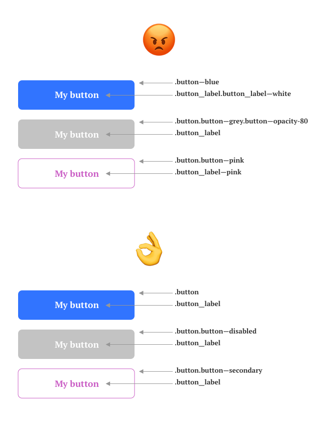
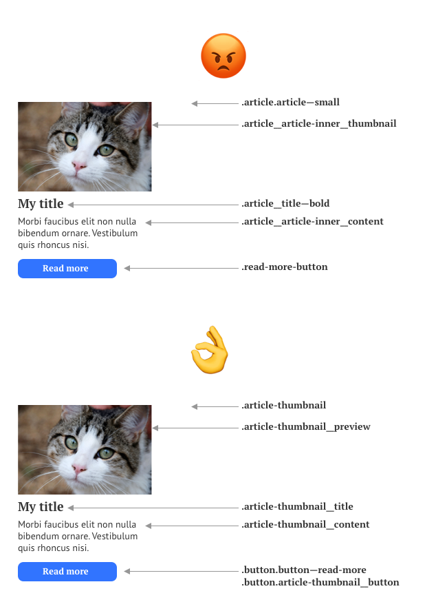

# EW Guidelines

Les différentes recommandations de ce document ont pour but de décrire des façons de développer pour le web côté client, selon une méthode qui se veut facile à lire, à maintenir, tout en respectant des standards globaux (accessibilité, performances, sécurité).

## Global

- le projet utilise des règles d'indentation cohérentes (nature de l'indentation, etc). Si besoin, se référer au fichier eslint du projet, ou utiliser un outil comme `Prettier` (sur un hook git par ex)
- le choix d'une techno (jQuery, React, etc) ne peut être proposé / soutenu que s'il présente un intérêt pour le projet (soit en temps de dev, soit en maintenance / évolutivité)
- sauf si la techno propose une nomenclature spéficique (React, classes PHP), nous utiliserons une syntaxe `kebab-case` pour tous les fichiers (Sass, JS, HTML)

## Tout est composant

Ces recommandations servent, dans la grande majorité, un but commun : penser chaque élément d'interface comme composant, ou comme composant de composant (etc.).
Cela permet un meilleure découpage de l'application ou du site et une meilleure lisibilité du code par rapport à l'interface.
En gros, le but est d'avoir quelque chose comme :
- un template (PHP, Twig, React, etc) = un composant
- un module JS = la couche fonctionnelle du composant
- un fichier Sass = la couche graphique du composant

## Nommage

Bien que ce ne soit pas obligatoire, une méthode de nommage permettant de refléter cette logique de composants (ex: BEM) est très recommandée.

### BEM

BEM définit un cadre pour nommer les éléments d'une interface selon une grammaire simple : Block, Element, Modifier.
Nous utiliserons les séparateurs "habituels" (`__`, `--`) couplés à une casse "kebab-case".

Exemple : `.main-block__my-element--my-modifier`

Les objectifs sont de :
- pouvoir copier / déplacer des composants sur tout le projet, sans effet de bord
- limiter les effets de bords en cas d'évolution / modification d'un composant
- apporter une lisibilité sur ce qui est représenté dans le code

### Profondeur des sélecteurs BEM

BEM admet plusieurs utilisations concernant la profondeur des sélecteurs. Toutefois, il me semble préférable de ne pas représenter des enfants et petits enfants avec ces sélecteurs, comme `.main-block__element__inner-element`

Ce genre de sélecteurs sont lourds et n'ont pas d'intérêts concernant la lisibilité du code. Tout au plus, ils reflètent la structure du DOM, ce qui est quelque chose qu'on essaye d'éviter au maximum (couplage trop fort entre HTML et CSS). Pour reprendre le cas du dessus, on utilisera plutôt : `.main-block__inner-element` (la référance à `element` étant inutile). 

*Le but est de représenter sémantiquement des éléments d'une interface graphique, pas une structure HTML.*

### Exemples, dos & don'ts

#### 1. un bouton




Explications
- on ne nomme pas les blocks, elements et modifiers selon leurs aspects graphiques (`.button--blue`) mais selon un état, une sémantique. Exemple : `.button--disabled` ou `.button--disabled`
- les modifiers ne doivent être appliqué que sur le block (le composant, pas ses éléments) : c'est le composant qui change d'état, ses enfants ne font que suivre le changement d'état de leur parent
- ne pas empiler les classes pour atteindre le résultat graphique attendu : un composant à un état donné a un rendu. S'il faut partager des propriétés graphiques, on peut se référer aux variables CSS ou mixins, functions et placeholders Sass.




Explications
- on ne nomme pas les blocks, elements et modifiers selon leurs aspects graphiques (`.article--small`) mais selon un état, une sémantique. Exemple : `.article-thumbnail`, à noter que `.article.article--thumbnail` aurait pu aussi faire l'affaire.
- ne pas représenter la structure du DOM via BEM, c'est inutile (`.article__article-inner__content`). Le fait de le préciser n'améliore pas la compréhension du code et sera source de problèmes. *De toute façon, on ne dit jamais "Je vais me gratter le nez du visage de mon corps" ? Je vais me gratter le nez suffit à comprendre.* 
- le cas du bouton est plus compliqué. `.read-more-button` n'est pas la meilleure solution : elle ne fait pas référence à un composant qu'on suppose déjà exister (dans le premier exemple), donc on aura du code CSS en double. Par ailleurs, en l'état, c'est un composant indépendant, il pourrait faire référence à son contexte (en tant qu'enfant de l'article).
`.button.button--read-more` semble plus pratique : il décrit une déclinaison du composant `.button`. 
`.button.article-thumbnail__button` peut être pratique également, il précise la filiation avec le composant `.button` et également le contexte : `.article-thumbnail` et des variations graphiques liées à ce contexte particulier du bouton dans une miniature d'article. 
Selon le projet, l'une ou l'autre technique peut être plus utile / appropriée.


## HTML

### Qualité

Quelques points à respecter pour produire un code HTML clean :

- le code HTML doit rester sémantique et ne doit contenir aucun aspect concernant sa représentation graphique. Par exemple, si un texte est tout en majuscule sur la maquette finale, ce sera fait via CSS, en HTML, le texte doit respecter les règles de typo standards.
- le code produit est valide (https://validator.w3.org/).
- les images déclarent systématiquement un attribut `alt`, qui doit reporter l'information donnée par l'image. C'est généralement le texte qu'elle contient. Pour proposer une description à l'image, on préférera l'attribut `title`.
- les ancres (`<a>`) ne sont utilisées que pour représenter des liens à un document exterieurs à la page, ou une section de la page. L'attribut href ne doit pas être vide ou contenir seulement `#`. Pour représenter des éléments cliquables (dont l'action est gérée en JS, par exemple), préférez un élément `<button>`.


### Performances

Quelques points à respecter pour produire un code HTML performant :
- limiter l'imbrication d'éléments HTML afin d'alléger la complexité du DOM et le poids de la page.
- utiliser les attributs `async` / `defer` tant que possible, ou reporter certaines ressources juste avant la fermeture de l'élément `body` afin de ne pas empêcher le rendu de la page
- limiter / ne pas utiliser d'appels à des ressources externes, sauf exceptions (services tiers, etc.). Exemple : les typos Google Font doivent être rappatriées dans le projet, idem pour les libs JS.

## Templating

Si une logique de templating est utilisée :
- essayez de conserver une logique de composants, en découpant les fichiers de template de façon à pouvoir les réutiliser sur tout le projet, indépendamment du contexte
- pas non plus trop découper

## CSS / Sass

- essayez de garder une structure cohérente : un fichier Sass <-> un composant BEM
- utilisez tant que possible (= tant que ça améliore la lisibilité du code) les opérateurs de concaténation (`&`), variables et boucles
- n'oubliez pas le reset.css

### Frameworks

- bien peser le pour et le contre du choix d'un framework, notamment Bootstrap ou Foundation : s'ils ne sont utilisé que pour leur grille, pourquoi ne pas se tourner vers CSS Grid layouts ?

### Les unités
- les tailles de texte sont décrit en REM, si besoin en utilisant une mixin Sass (ou un CSS calc(), mais...) pour la conversion
- tant que possible, pour décrire des largeurs de blocs, on préférera utiliser des `%` ou `vw` (si le projet le permet)
- minimiser le nombre de points de rupture. Par exmple, plutôt que de définir des largeurs de conteneurs fixes, en `px`, avec points de rupture les redéfinissant 4 ou 5 fois. Ce genre de bout de code peut être facilement remplacé en utilisant les `%` et `max-width`.
```
.container {
  width: 1200px;
  @media screen and (max-width: 1200px) {
    width: 1000px;
  } /* 😡 */
  @media screen and (max-width: 1000px) {
    width: 800px;
  } /* 😡😡 */
  @media screen and (max-width: 800px) {
    width: 600px;
  } /* 😡😡😡 */
  @media screen and (max-width: 6000px) {
    width: 400px;
  } /* 😡😡😡😡 */
  @media screen and (max-width: 400px) {
    width: 320px;
  } /* 😡😡😡😡😡 */
} 

/* 🙏🙏🙏🙏🙏🙏🙏 */
.container {
  width: 90%;
  max-width: 1200px;
}
/* 🙏🙏🙏🙏🙏🙏🙏 */
```


## JS

### Structure

- essayez de garder une structure cohérente : un module JS <-> un composant BEM

### Composants

- tester la présence d'un composant / élément avant d'appeler du code dessus
- le module JS exporte une méthode ou une fonction `init` pour initialiser le composant
- le module JS doit être structuré (soit en fonctions, soit en définissant une classe + méthodes associées)


### Performances

Tant que possible :
- n'utilisez JS que pour ajouter / supprimer des classes sur le DOM (évitez d'injecter / supprimer directement des éléments du DOM)
- évitez l'utilisation de fonctions / méthodes (en particulier celles qui manipule le DOM) dans une boucle


## TODO
- ajouter des exemples de projet et de modules JS, fichiers Sass et fichier de template dans un dossier `examples`
- relire un coup 😅
- garder à jour 😅